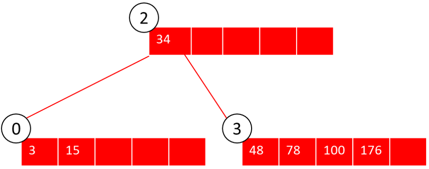

<h1> Practica 4 FOD </h1>
<h2> Arboles </h2>

**<span style="color: green"> 1. Definir la estructura de datos correspondiente a un árbol B de orden M, que almacenará información correspondiente a alumnos de la facultad de informática de la UNLP. De los mismos deberá guardarse nombre y apellido, DNI, legajo y año de ingreso. ¿Cuál de estos datos debería seleccionarse como clave de identificación para organizar los elementos en el árbol? ¿Hay más de una opción? Justifique su elección</span>**

Los arboles B son arboles multicamino, con las siguientes propiedades:
* Cada nodo del arbol contiene como máximo M descendientes y M-1 elementos
* La raiz no posee descendientes directos o tiene al menos 2.
* Un nodo con X descendientes directos contiene X-1 elementos.
* Todos los nodods (menos la raiz) tienen como mínimo [M/2] – 1 elementos y como máximo M-1.
* Todos los nodos terminales se encuentran al mismo nivel.

Definimos la estructura:

```pascal
CONST
  M = ...// orden del arbol
TYPE
  str30 = string[30];
  alumno = record
    nombre: str30;
    apellido: str30;
    DNI: integer;
    legajo: integer;
    anioIngreso: integer;
  end;

  nodo = record
    cant_claves: integer;
    claves: array[1..M-1] of alumno;
    hijos : array[1..M] of integer;
  end;

  arbol = file of nodo;

```

De estos datos, los que podrían elegirse como clave son:
* Legajo
* DNI

Dado que son campos únicos (no deberían repetirse en los alumnos), y ademos al ser enteros son ordinales, con lo que podemos utilizarlos para ir construyendo los nodos.

----------------------------------------------------------

**<span style="color: green"> 2. Redefinir la estructura de datos del ejercicio anterior para un árbol B+ de orden M.
Responda detalladamente:</span>**
* **<span style="color: green"> a. ¿Cómo accede a la información para buscar al alumno con DNI 23.333.333?</span>**
* **<span style="color: green"> b. ¿Cómo accede a la información para buscar al alumno José Perez? </span>**
* **<span style="color: green"> c. Indique cuáles son las ventajas que ofrece este tipo de árbol para el caso de la búsqueda planteada en el inciso b </span>**


Los arboles B+, constituyen una mejora sobre los árboles B, ya que:
* conservan la propiedad de acceso aleatorio rápido
* permiten además un recorrido secuencial rápido.

`Conjunto índice:` Proporciona acceso indizado a los registros. **Todas las claves se encuentran en las hojas**, duplicándose en la raíz y nodos interiores aquellas que resulten necesarias para definir los caminos de búsqueda.

`Conjunto secuencia:` Contiene todos los registros del archivo. Las hojas se vinculan para facilitar el recorrido secuencial rápido. Cuando se lee en orden lógico, lista todos los registros por el orden de la clave.

Redefinimos la estructura:
```pascal
CONST
  M = ...// orden del arbol
TYPE
  str30 = string[30];
  alumno = record
    nombre: str30;
    apellido: str30;
    DNI: integer;
    legajo: integer;
    anioIngreso: integer;
  end;

  nodo = record
    cant_claves: integer;
    claves: array[1..M-1] of alumno;
    hijos : array[1..M] of integer;
    siguiente: integer; // preguntar si esta bien..seria el puntero al hno
  end;

  arbol = file of nodo;

```

a- Para buscar al alumno con DNI 23.333.333, se comienza buscando por la raíz, pero dado que los elementos se encuentran en las hojas, la búsqueda deberá continuar hasta llegar a las mismas.
Si el árbol tiene por clave de identificación el DNI del alumno, entonces bastará con ir comparando por mayor y menor desde la raíz hacia las hojas, hasta llegar al elemento deseado.

b- En caso de buscar al alumno por su nombre, debería aprovecharse el acceso secuencial de las hojas, ya que no podemos aprovechar las claves del árbol para utilizar una búsqueda mejorada.

c- La ventaja de la búsqueda por clave, es que reducimos el tiempo del algoritmo, ya que a medida que hacemos las comparaciones con la raíz podemos ir descartando sub-arboles.<br>
En el otro caso, el tiempo de búsqueda es lineal.

-----------------------------------------------------------

**<span style="color: green">3. Dado el siguiente algoritmo de búsqueda en un árbol B:**

```pascal
function buscar(NRR, clave, NRR_encontrado, pos_encontrada)
begin
  if (nodo = null)
    buscar := false; {clave no encontrada}
  else
      posicionarYLeerNodo(A, nodo, NRR);
  if (claveEncontrada(A, nodo, clave, pos)) then begin
    NRR_encontrado := NRR; {NRR actual)
    pos_encontrada := pos; {posición dentro del array}
  end
  else
    buscar(nodo.hijo[pos], clave, NRR_encontrado, pos_encontrada)
end;
```

**<span style="color: green">Asuma que para la primera llamada, el parámetro NRR contiene la posición de la raíz del árbol. Responda detalladamente:</span>**

<span style="color: green">a. PosicionarYLeerNodo(): Indique qué hace y la forma en que deben ser enviados los parámetros (valor o referencia).</span>

<span style="color: green">b. claveEncontrada(): Indique qué hace y la forma en que deben ser enviados los parámetros (valor o referencia). ¿Cómo lo implementaría?</span>

<span style="color: green">c. ¿Existe algún error en este código? En caso afirmativo, modifique lo que considere
necesario.</span>

-----------------------------------------------------------------

**<span style="color: green">
4-Defina los siguientes conceptos:**</span>

* <span style="color: green">Overflow</span>
* <span style="color: green">Underflow</span>
* <span style="color: green">Redistribución</span>
* <span style="color: green">Fusión o concatenación</span>

<span style="color: green">En los dos últimos casos, ¿cuándo se aplica cada uno?</span>

El `overflow`, se produce cuando un nodo de grado M supera la cantidad máxima de elementos (M).<br>
En este caso, lo que se hace es:
* Se crea un nuevo nodo
* La primera mitad de las claves se mantiene en el nodo con overflow.
* La segunda mitad de las claves se traslada al nuevo nodo.
* La menor de las claves de la segunda mitad se promociona al nodo padre.

En el caso de los árboles B+, la única diferencia en este proceso es que luego de separarse el nodo con overflow, en caso de estar en una **hoja**, la menor de las claves del nodo derecho sube una COPIA al padre.

El `underflow` es el caso contrario, y se produce cuando en un nodo de grado M nos quedamos con menos de la cantidad mínima de elementos: [M/2] - 1.<br>
En dicho caso, dependiendo de la política:
* Primero se intenta redistribuir con un hermano adyacente
* Si la distribución no es posible, entonces se debe fusionar con un hermano adyacente.

La `redistribución` se aplica en los casos de underflow, y la condición necesaria es que el hermano adyacente tenga la cantidad de elementos suficientes como para poder ceder claves al nodo con underflow, sin entrar él mismo en la misma situación.

La `Fusion`, se da en aquellos casos en que el hermano adyacente no puede ceder elementos, ya que quedaría en underflow, por lo cual:
* se fusionan ambos nodos
* en algunos casos puede disminuir la altura del arbol.

--------------------------------------------------------------

**5. Dado el siguiente árbol B de orden 5, mostrar como quedaría el mismo luego de
realizar las siguientes operaciones: +320, -390, -400, -533. Justificar detalladamente
cada operación indicando lecturas y escrituras en orden de ocurrencia. Para la
resolución de underflow debe utilizar política a izquierda. Graficar cada operación por
separado.**

Estado inicial:


<br>`+320:`

Los pasos que realiza son:
* Leo nodo 2
* Leo nodo 1
* Escribo nodo 1. Como el nodo 1 no tiene más lugar, entro en overflow.
* Creo el nodo 6
* Las claves 225 y 241 se quedan en el nodo 1, la clave 320 asciende como padre, y escribo las claves 331 y 360 en el nodo 6.
* Al ascender la clave 320, se produce overflow en el nodo 2.
* Creo un nuevo nodo 7, las claves 220 y 225 se quedan en el nodo 2, creo un nuevo nodo 8 y asciendo la clave 320, luego las claves 445 y 541 van al nodo 7.


<br>`-390:`

* Leo nodo 8
* Intercambio el 390 por el mas pequeño del subarbol derecho:
  * Leo nodo 4, e intercambio 390 por 400
* Elimino el 390 del nodo 4, como M es 5, la cantidad minima de elementos es 1. Con lo cual el nodo 4 NO entra en underflow.


<br>`-400:`

* Leo el nodo 8
* Intercambio el 400 por el minimo de su arbol derecho (407). Para lo cual leo el nodo 7 y leo el nodo 4. Escribo nodo 4 y nodo 8
* Elimino el 400 del nodo 4, entro en underflow.
* Si bien estoy con política izquierda, como no tengo hermano izquierdo debo ir a la derecha.
* El nodo 5 puede redistribuir sin entrar en underflow, asi que:
  * Baja el 455 al nodo 4
  * Sube el 508 al nodo 7.

L8 - L7 - L4 - L5 - E4 - E5 - E7 - E8


<BR>`-533`

L8 - L7 - L5 - L3 - E4 - E7

* Leo el nodo 8
* Leo el nodo 7
* Leo el nodo 5 y elimino el 533
* Como el N5 entra en underflow, intento redistribuir por izquierda. Dado que el N4 entra en underflow, lo fusiono con el nodo 5. Para lo cual debo bajar el elemento separador 508 y escribirlo en el N4.


-----------------------------------------------------------------

<br>**6. Dado el siguiente árbol B de orden 4, mostrar cómo quedaría el mismo luego de realizar
las siguientes operaciones: +5, +9, +80, +51, -50, -92.
Política de resolución de underflows: derecha.**


<br>`+5`

L2 L0 E2 E0 E4
* Leo el nodo 2
* Leo el nodo 0
* Escribo el nodo 0 y entro en overflow: 5 22 32 50
* Creo el nodo 3
* 5 y 22 quedan en el nodo 0, 32 es promovido a padre, 50 queda en nodo 3.


<br>`+9`

L2 L0 E0

* Leo nodo 2
* Leo nodo 0
* Escribo nodo 0, no hay riesgo de overflow.


<br>`+80`

L2 L1 E2 E1 E4

* leo nodo 2
* Leo nodo 1
* Escribo el 80 en el nodo 1, quedando en Overflow
* Creo el nodo 4, y redistribuyo: 77 79 80 92
* 77 y 79 quedan en el nodo 1, 80 asciende como padre, 92 se escribe en el nodo 4


<br>`+51`

L2 L3 E3
* Leo nodo 2
* Leo nodo 3
* Escribo nodo 3


<br>`-50`

L2 L3 E3
* Leo el nodo 2
* Leo el nodo 3
* Elimino el 50, quedando solamente el 51. Dado que la cantidad minima de elementos es 0, estoy OK.


<br>`-92`

L2 L4 L1 E1 E4 E2

* Leo nodo 2
* Leo nodo 4
* Elimino 92, quedo en underflow.
* Por politica derecha, redistribuyo con nodo1 bajando el elemento separador y subiendo el 79 al nodo 2.


-------------------------------------------------------
7. Dado el siguiente árbol B de orden 6, mostrar como quedaría el mismo luego de realizar
las siguientes operaciones: +15, +71, +3, +48, -56, -71.
Política de resolución de underflows: derecha o izquierda.

0: (34) (56) (78) (100) (176)

`+15`

Al agregar el 15, el nodo 0 entra en overflow, por lo tanto se deben separar los elementos.

* 15 34 56  quedan en el nodo izquierdo
* 100 176 quedan en el nodo derecho
* 78 asciende como padre

LE/E necesarias: L0, E0, E1, E2.


<br>`+71`

El 71 ingresa sin problemas en el nodo 0.

LE/E necesarias: L2, L0, E0.


<br>`+3`

De igual manera, el 3 ingresa en el nodo 0 sin problemas

LE/E: L2, L0, E0.


<br>`+48`

Al agregar el 48, el nodo 0 entra en overflow, con lo cual debemos proceder a solucionarlo:
* Tenemos: 3 - 15 - 34 - 48 - 56 - 71
* Nodo izquierdo: 3 - 15 - 34
* Se crea el nodo 3 y van el 56 y 71
* El 48 sube como padre al nodo 2

LE/E necesarias: L2, L0, E0, E3, E2


<BR>`-56`

Al restar el 56, el nodo 3 entra en underflow (ya que debe tener como mínimo 6/2 - 1 = 1 hijos)

La política de resolución de underflow es derecha o izquierda, con lo cual:
* Veo si puedo redistribuir con el 1 -> NO
* Veo si puedo redistribuir con el 0 -> SI
* Redistribuyo

LE/E necesarias: L2, L3, E0, E3, E2


<br>`-71`

Al eliminar el 71 del nodo 3, el mismo entra en underflow, y de acuerdo a la política:
* Veo si puedo redistribuir con nodo 1 -> NO
* Veo si puedo redistribuir con nodo 0 -> NO
* Fusiono con nodo 1

LE/E necesarias: L2, L3, L1, L0, E3, E1, E2



---------------------------------------------------

8. Dado el siguiente árbol B de orden 5, mostrar como quedaría el mismo luego de realizar las siguientes operaciones: +450, -485, -511, -614. Política de resolución de underflows: derecha.


<br>`+450`


Para dar de alta el 450, el nodo 1 queda en overflow, con lo cual:
* Creo el nodo 6
* Queda 333 y 390 en nodo 1
* Queda 450 y 454 en nodo 6
* 442 sube como padre al nodo 2

Al subir el 442, el nodo 2 entra en overflow, con lo cual:
* creo el nodo 7
* Queda 315 y 442 en nodo 2
* Queda 541 y 639 en nodo 7
* Creo el noddo 8 y sube el 485 como padre


<br>`-485`

El 485 se encuentra en la raíz, con lo cual para proceder a su baja debemos:
* Intercambiar el 485 con el 508 (menor de sus hijos de la rama derecha)
* Dar de baja el 485 desde el nodo 4, como mantiene 1 elemento no entra en underflow.

LE/E necesarias: L8, L7, L4, E4, E8


<br>`-511`

Al dar de baja el 511, el nodo 4 entra en undeflow. Como la política de resolución de underflow es derecha, me fijo con el nodo 5 (hno adyacente derecho si puedo redistribuir)

Como la redistribución es posible, me quedaría el 547 en nodo 4, 614 como nuevo elemento separador y 633 como nodo 5.

LE/E: L8, L7, L4, L5, E4, E5, E7


<br>`-614`

Para dar de baja el 614, debemos moverlo primero a una hoja. Con lo cual intercambiamos el 547 por el 633, quien nos queda en el nodo 5.

El nodo 5 quedaría en underflow, con lo cual siguiendo la política de resolución debo ver al hermano adyacente derecho, con el cual puedo fusionar tranquilamente

LE/E necesarias: L8, L7, L5, L3,  E4, E5, E3, E7.


----------------------------------------------------------


9. Dado un árbol B de orden 5  y con política izquierda, para cada operación dada:
* a. Dibuje el árbol resultante
* b. Explique las decisiones tomadas
* c. Escriba las lecturas y escrituras

Operaciones: -76, -400, +900, +12


<br>`-76`

Para dar de baja el 76, debo bajarlo al nivel de hojas, y para eso lo reemplazo por el menor de su subarbol derecho. En este caso por el 100 en el nodo 4.

Luego, el nodo 4 queda con 76 y 200. Al eliminar el 76, el nodo NO entra en underflow, con lo cual no tenemos que hacer mayores cambios.

LE/E: L2, L4, E4, E2


<br>`-400`

Al dar de baja el 400, el nodo 1 queda en underflow.
Como tengo politica izquierda, intento redistribuir con el nodo 4. Al no poder hacerlo, fusiono el nodo 4 y bajo el elemento separador.

LE/E : L2, L1, L4, E4, E1, E2


<br>`+900`

El 900 lo doy de alta en el nodo 3, no hay mayores inconvenientes.


<br>`+12`

Al dar de alta el 12, el nodo 0 entra en overflow. Es por ello que debo crear un nuevo nodo (reutilizo el 1), y nos quedan 12 y 21 en el nodo 0, 46 y 70 en el 1, y sube el 45 al nodo 2

LE/E: L2, L0, E0, E1, E2


----------------------------------------------------------

10. Dada las siguientes operaciones, mostrar la construcción paso a paso de un árbol B de
orden 4: +50 , +70, +40, +15, +90, +120, +115, +45, +30, +100, +112, +77, -45, -40, -50, -90, -100.<br>
Política de resolución de underflows: izquierda o derecha.

`+50 , +70, +40`


<br>`+15`

Al dar de alta el 15, el nodo 0 entra en overflow, con lo cual:
* Creo el nodo 1
* Separo 15 y 40 en nodo 0, 70 en nodo 1
* Creo el nodo 2
* Asciendo el 50 como padre

LE/E = L0, E0, E1, E2


<br>`+90, +120`

Tanto el 90 como el 120 pueden insertarse sin problemas en el nodo 1.

LE/E = L2, L1, E1


<br>`+115`

Al dar de alta el 115, el nodo 1 entra en overflow.
De esta forma se crea el nodo 3, se separa el 70 y 90 en nodo 1, 120 en nodo 3, y 115 sube como padre al nodo 2.

LE/E = L2, L1, E1, E3, E2


<br>`+45`

El 45 entra sin problemas en el nodo 0


<br>`+30`

Al dar de alta el 30, el nodo 0 entra en overflow.

De esta manera, se genera el nodo 4, y se divide:
* Nodo 0: 15 y 30
* Nodo 4: 45
* Nodo 2: 40

LE/E: L2, L0, E0, E4, E2


<br>`+100`

El 100 ingresa sin problemas en el nodo 1


<br>`+112`

Al dar de alta el 112, el nodo 1 entra en overflow:
* creo el nodo 5
* separo 70 y 90 en nodo 1, 100 en nodo 5, subo el 112 al 2.

Al subir el 112, el nodo 2 entra en overflow:
* Creo el nodo 6
* 40 y 50 quedan en nodo 2
* 115 va al nodo 6
* Creo el nodo 7 y sube 112 como padre.


<br>`+77`

El 77 se da de alta sin problemas en el nodo 1.


<br>`-45`

Al dar de baja el 45, el nodo 4 entra en underflow. Por política, debemos intentar redistribuir con su hermano adyacente izquierdo, el cual puede hacerlo sin mayores inconvenientes.

El 45 se elimina, baja el elemento separador 40, y el 30 pasa al nodo 2.

LE/E: L7, L2, L4, L0, E0, E4, E2


<br>`-40`

Al dar de baja el 40, el nodo 4 entra en underflow. Por politica, veo si puedo redistribuir con el nodo 0. Como no es posible, miro si puedo distribuir con el nodo 1.

En este caso puede hacerse la redistribucion sin mayores inconvenientes, con lo cual:
* Se elimina el 40
* Baja el 50
* Sube el 70 como elemento separador.

LE/E = L7, L2, L4, L0, L1, E4, E1, E2


<br>`-50`

Es similar al caso anterior, no puedo redistribuir con el hno izquierdo, con lo cual lo hago con el derecho.

LE/E: L7,L2 L4, L0, L1, E4, E1, E2


<br>`-90`

Al dar de baja el 90, el nodo 1 entra en underflow. Independientemente de la politica, como el unico hermano que tiene es el izquierdo, intento redistribuir con él.

Como el nodo 4 quedaría en underflow, la unica opcion que queda es la fusion, liberando al nodo1.

LE/E: L7, L2, L1, L4, E4, E1, E2


<br>`-100`

Al dar de baja el 100, el nodo 5 queda en underflow. Como no tiene hermano izquierdo, si o si debe mirar al hermano derecho, quien al no poder redistribuir fusiona.

Al bajar el elemento separador del 6, el nodo 6 queda en underflow y debe fusionarse con el nodo 2.

El elemento separador del nodo 7 baja, y el arbol reduce un nivel.

ACLARACION -> durante todo el ejercicio, el elemento del nodo 7 es el 100 y no el 115. Luego el 112 debería haber estado siempre en el nodo 5.

LE/E: L7, L6, L5, L3, E5, E3, E6, L2, E2, E7.


------------------------------------------------------------

11. Dadas las siguientes operaciones, mostrar la construcción paso a paso de un árbol B de
orden 5:

Política de resolución de underflows: izquierda.

+80, +50, +70, +120, +23, +52, +59, +65, +30, +40, +45, +31, +34, +38, +60, +63, +64, -23,
-30, -31, -40, -45, -38.


`+80, +50, +70, +120, +23`

Los primeros 4 elementos se insertan sin problemas en el nodo 0.

Luego, al intentar insertar el 23, el nodo 0 entra en overflow, con lo cual:
* Se crea el nodo 1
* Se distribuye:
  * 23 y 50 en nodo 0
  * 80 y 120 en nodo 1
* Se crea nodo 2 y asciende 70 como padre


<br>`+52, +59`

Se insertan sin problemas en el nodo 0


<br>`+65`

Al insertar el 65 en el nodo 0, el mismo entra en overflow.

Se crea entonces el nodo 3:
* 23 y 50 permanecen en nodo 0
* 52 sube al nodo 2 como nuevo elemento separador
* 59 y 65 quedan en el nuevo nodo 3

LE/E: L2, L0, E0, E3, E2


<br>`+30 +40`

Los elementos 30 y 40 ingresan sin mayores inconvenientes en el nodo 0


<br>`+45`

Al ingresar el 45, el nodo 0 entra en overflow.

De esta forma se crea el nodo4, y se distribuye:
* 23 y 30 quedan en el nodo 0
* 40 sube como elemento separador al nodo 2
* 45 y 50 van al nuevo nodo

LE/E: L2, L0, E0, E4, E2


<br>`+31 +34`

Ambos elementos pueden ingresarse sin problemas en el nodo 0


<br>`+38`

Al ingresar el 38, el nodo 0 entra en overflow:
* Se crea el nodo 5
* Quedan el 23 y 30 en el nodo 0
* Van el 34 y 38 al nodo 5
* Sube el 31 al nodo 2 como nuevo elemento separador.

LE/E: L2, L0, E0, E5, E2


<br>`+60 +63`

Ambos elementos se añaden sin problemas en el nodo 3.


<br>`+64`

Al ingresar el 64, el nodo 3 entra en overflow

Es por eso que:
* Se crea nodo 6
* Se distribuye 59 y 60 en nodo 3, 63 sube al nodo 2 y 64 y 65 van al nodo 6
* Al subir el 63, el nodo 2 entra en overflow:
  * Se crea nodo 7
  * se distribuye 31 y 40 en nodo 2
  * 63 y 70 en nodo 7
  * Se crea nodo 8 y sube el 52 como padre

L2 , L3 , E3, E6, E2, E7, E8

  

<br>`-23`

La baja del 23 se hace sin mayores inconvenientes, ya que el nodo 0 no entra en underflow.

L8, L2, L0, E0

  

<br>`-30`

Al dar de baja el 30, el nodo 0 entra en underflow. Como no tiene hijo izquierdo, redistribuye con el hijo derecho, más allá de la política.

L8, L2, L0, E0, E5, E2


<br>`-31`

Al dar de baja el 31, el nodo 0 entra en underflow. Como no tiene hermano izquierdo, si o si debe mirar a su hermano derecho.

Dado que el hermano derecho no puede ceder elementos, se deben fusionar, quedando libre el nodo 5.

L8, L2, L0, E0, E5, E2


<br>`-40`

Para dar de baja el 40, debo reemplazarlo por el menor de sus elementos del subarbol derecho, en este caso el 45.

Puedo borrar luego sin inconvenientes.

L8, L2, L4, E4, E2


<br>`-45`

Para eliminar el 45, debo reemplazarlo por el menor de sus hijos del subarbol derecho, en este caso el 50.

Una vez que tengo al 45 en el nodo 4, al eliminarlo entro en underflow.

Por politica, debo mirar al hermano adyacente izquierdo, en este caso el nodo 0, quien puede redistribuir sin problemas.

L8, L2, L4, L0, E0, E4, E2


<br>`-38`

Como el 38 no esta en una hoja, debo intercambiarlo con el 50

Al dar de baja el 38 en el nodo 4, el mismo entra en underflow. Por politica intento redistribuir con el nodo 0, pero como no puedo fusiono.

Al fusionar baja el elemento separador 50, y el nodo 2 entra en underflow.

Como no tengo hermano izquierdo, si o si miro al derecho, con el cual puedo redistribuir sin problemas.

De esta forma queda el 52 en el nodo 2, el 63 como nuevo padre.

L8, L2, L4, L0, E0, L7,  E2, E7, E8


-----------------------------------------
14. Dado el siguiente árbol B + de orden 4 y con política de resolución de underflows a
derecha, realice las siguientes operaciones indicando lecturas y escrituras en el orden
de ocurrencia. Además, debe describir detalladamente lo que sucede en cada
operación. +80, -400.


<br>`+80`

Al agregar el 80, el nodo 0 entra en overflow.

Para solucionarlo, se crea el nodo 5, se separa:
* el 11 y 50 en nodo 0
* 77 y 80 en nodo 5
* Sube la copia del 77 al nodo 4

El nodo 4 entra en overflow (propagacion)

Para solucionarlo:
* Se crea nodo 6
* Se separa 80 y 340 en nodo 4
* 500 en nodo 5
* Se crea el nodo 7 y sube el 400 como padre.

LE/E = L4, L0, E0, E5, E4, E6, E7


<br>`-400`

El 400 no existe como elemento real, con lo cual lo que sucede es:
* Leo nodo 7
* Leo nodo 4
* Leo nodo 1
* Aprovecho el acceso secuencia para ir al nodo 2
* No encuentro el 400
