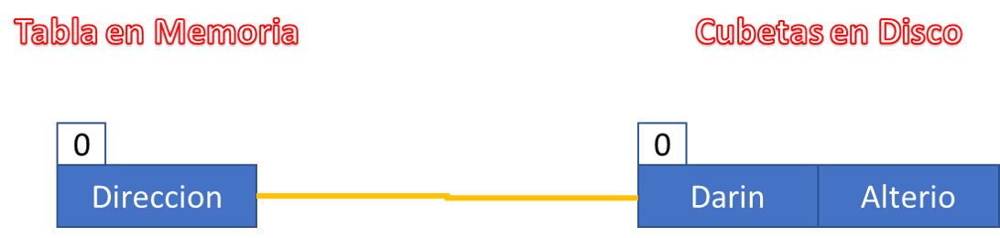
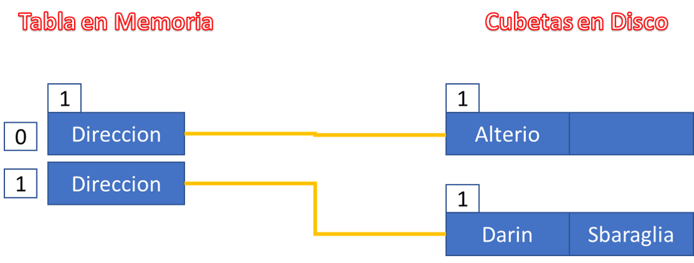
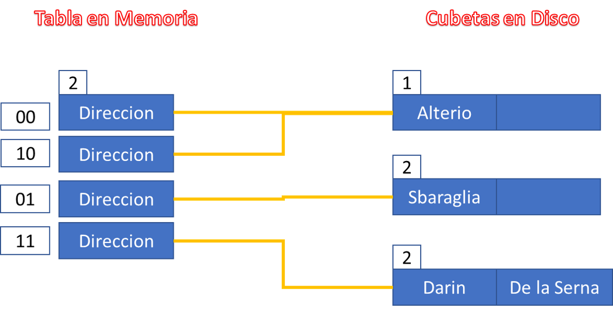
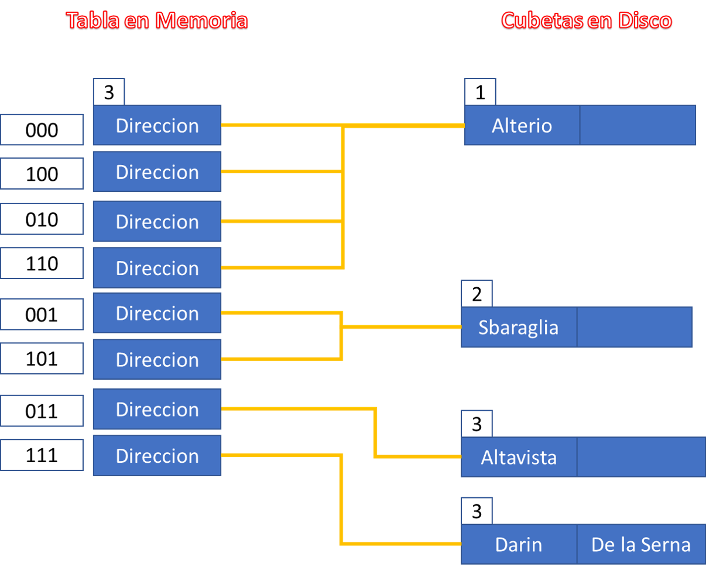

*16. Para las siguientes claves, realice el proceso de dispersión mediante el método de hashing
extensible, sabiendo que cada nodo tiene capacidad para dos registros. El número natural
indica el orden de llegada de las claves. Se debe mostrar el estado del archivo para cada
operación. Justifique brevemente ante colisión y desborde los pasos que realiza.*

* 1 Darin 00111111
* 2 Alterio 11110100
* 3 Sbaraglia 10100101
* 4 De la Serna 01010111
* 5 Altavista 01101011
* 6 Grandinetti 10101010

Las primeras dos claves entran sin inconvenientes, por orden de llegada

 **+Sbaraglia**

Al ingresar sbaraglia, el nodo 0 entra en saturación, con lo cual debo crear una nueva cubeta y aumentar el valor asociado a la cubeta.

Comparo el valor asociado a la cubeta con el numero de mi tabla en memoria, como 1>0 debo duplicar la cantidad de direcciones en mi tabla en memoria, y el valor asociado a la tabla se incrementa en 1.

Debo ahora redistribuir las claves, como Darin y Sbaraglia terminan en 1, voy a ponernos en el nodo referenciado por la direccion 1, meintras que alterio queda en el nodo original.

 **+De la Serna**

De la serna termina en 1, con lo cual tengo que ir a ver la cubeta apuntada por la direccion 1.

La cubeta está completa, con lo cual se genera overflow. Debo crear una cubeta nueva, y ponerle el valor 2 a las cubetas en conflicto.

Comparo el valor asociado a la cubeta con el valor asociado a la tabla en memoria, y como es mayor necesito duplicar la cantidad de direcciones para poder referenciar las cubetas en disco.

Luego, redistribuyo las claves

**+Altavista**

Altavista termina el 11, al ir a la cubeta referenciada por la direccion terminada en 11 veo que está llena, con lo cual debo:
* Crear una nueva cubeta
* Poner 3 al valor asociado a las dos cubetas en conflicto
* Comparo 3 con el valor asociado a la tabla en memoria, como 3>2 debo duplicar nuevamente la cantidad de direcciones.
* Asigno las referencias
* Redistribuyo las claves Darin, De la Serna, Altavista

** + Grandinetti**

Grandinetti termina en 010.

La cubeta apuntada por 010 tiene lugar, con lo cual no hay inconvenientes.

