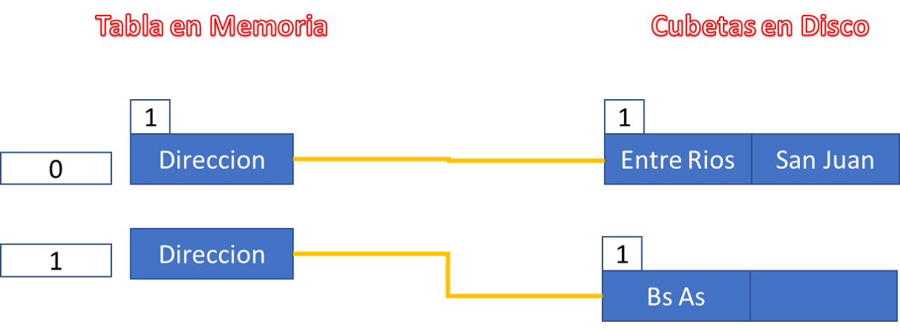
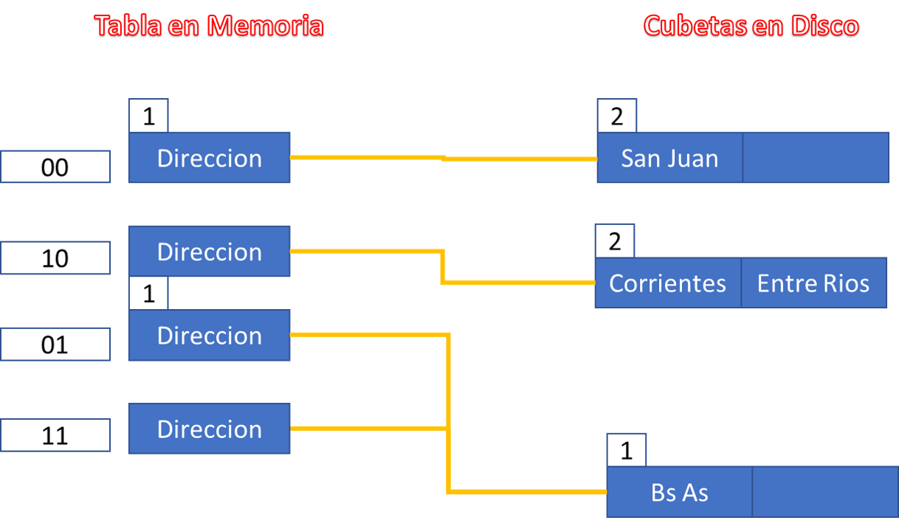
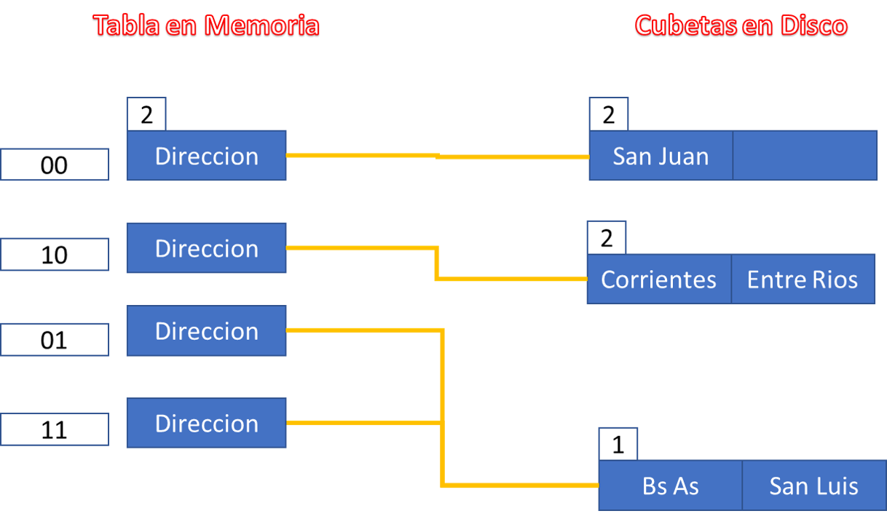
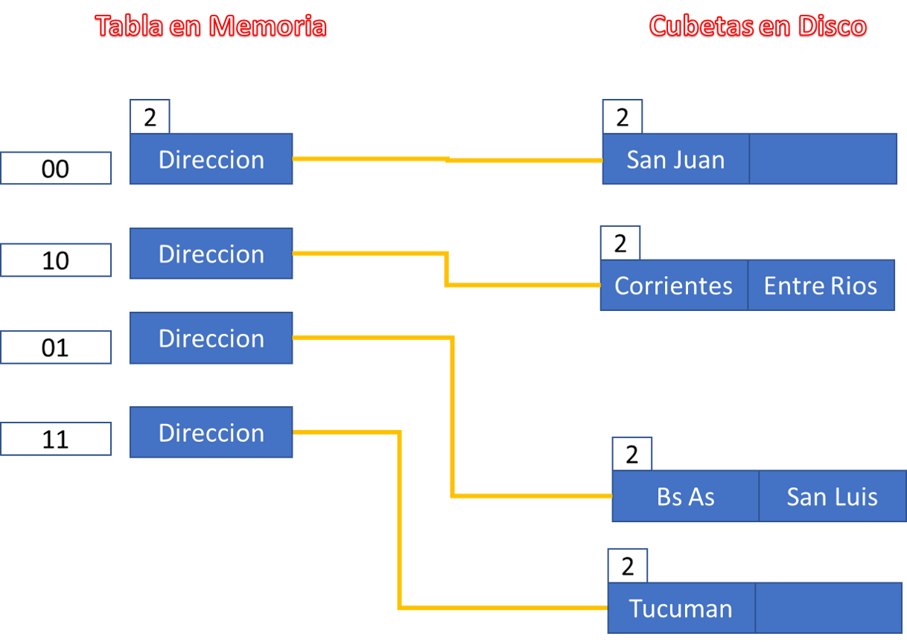
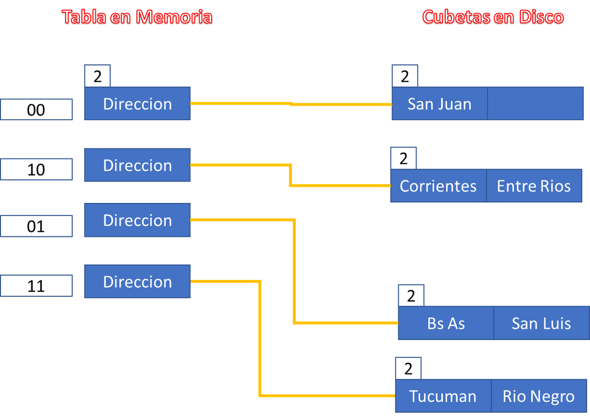
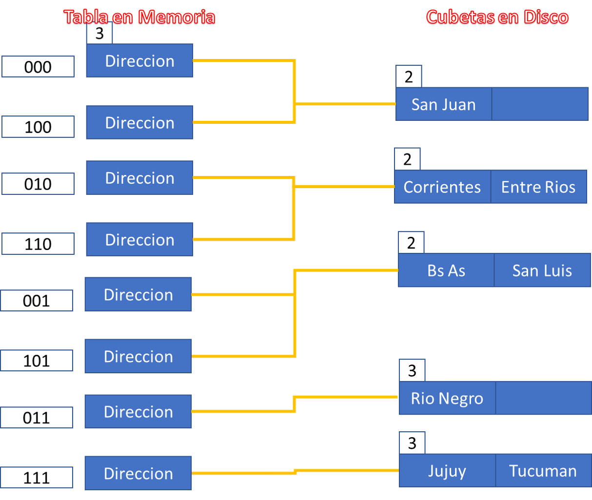

*17. Realice el proceso de dispersión mediante el método de hashing extensible, sabiendo
que cada registro tiene capacidad para dos claves. El número natural indica el orden de
llegada de las mismas. Se debe mostrar el estado del archivo para cada operación. Justifique
brevemente ante colisión y desborde los pasos que realiza.*

* 1 Buenos Aires ....1001
* 2 San Juan ....0100
* 3 Entre Ríos ....1110
* 4 Corrientes ....0010
* 5 San Luis ....0101
* 6 Tucumán ….0111
* 7 Rio Negro ….0011
* 8 Jujuy ….1111

Las dos primeras claves (Buenos Aires y San Juan) ingresan sin problemas en el nodo inicial.

**+Entre Rios 1110**

Al ingresar Entre Rios, la cubeta inicial entra en overflow.

Debo:
* Crear nueva cubeta
* Poner en 1 el numero asociado a las dos cubetas en conflicto
* COmparo el numero asociado a la cubeta con el numero en la table de direcciones, como es mayor necesito duplicar la cantidad de direcciones para poder referenciar todas las cubetas en disco.
* Duplico direcciones, pongo en 1 el numero asociado a la tabla de memoria, reasigno referencias y redistribuyo claves en disco.

**+Corrientes**

Corrientes termina en 0

Como mis cubetas referenciadas por la direccion 0 están completas, se produce colision y overflow.
* Genero cubeta nueva
* Aumento el numero asociado a las cubetas en conflicto (2)
* Comparo dicho numero con el valor asociado a la tabla en memoria, al ser mayor debo duplicar la cantidad de direcciones
* Duplico cantidad de direcciones, asigno referencias  a las cubetas en conflicto, reasigno elementos.

**+San Luis 0101**

San luis puede ingresar sin inconvenientes, colisiona con BsAS, pero no se genera overflow.

**+Tucumán ….0111**

Al intentar insertar tucuman, se genera overflow en el nodo referenciado por las claves 01 y 11.

Es por ello que:
* Debo crear un nuevo nodo
* Debo aumentar el numero asociado a dichas cubetas
* Comparo dicho numero con el numero asociado a la tabla en memoria, como son iguales no necesito crear mas direcciones.
* Reasigno los elementos en las cubetas en conflicto

**+7 Rio Negro ….0011**

Rio negro colisiona con tucuman, pero se inserta sin problemas

**Jujuy ….1111**

Al intentar insertar Jujuy, genera overflow en la cubeta referenciada por la direccion 11, por lo que:
* Se crea nueva cubetas
* Se asigna numero 3 a las mismas
* Se compara con el numero de referencia en la tabla en memoria, como es menor necesito duplicar la cantidad de direccioens
* Reacomodo los enlaces
* Reasigno las claves en las cubetas

